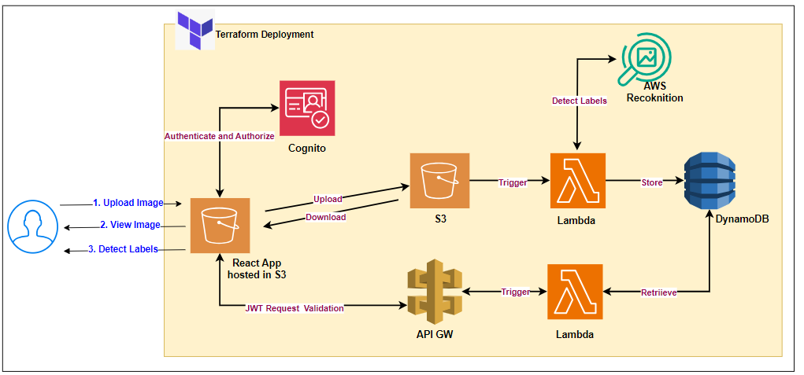
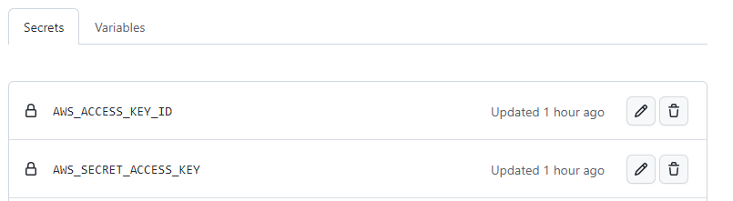
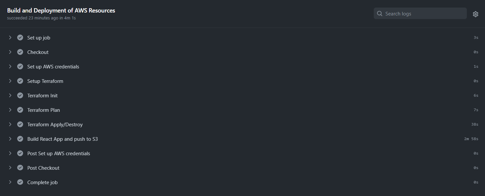
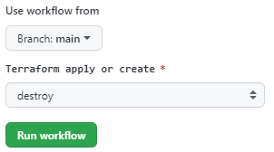
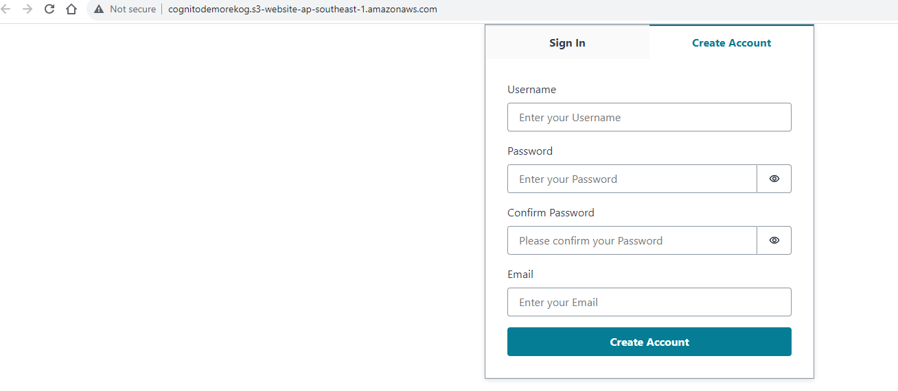
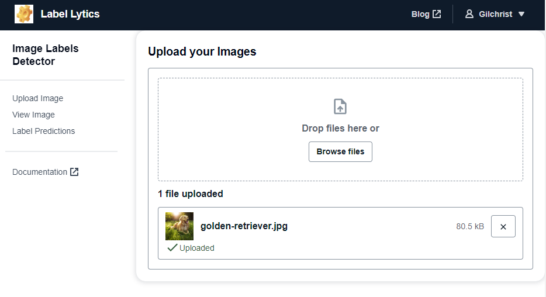
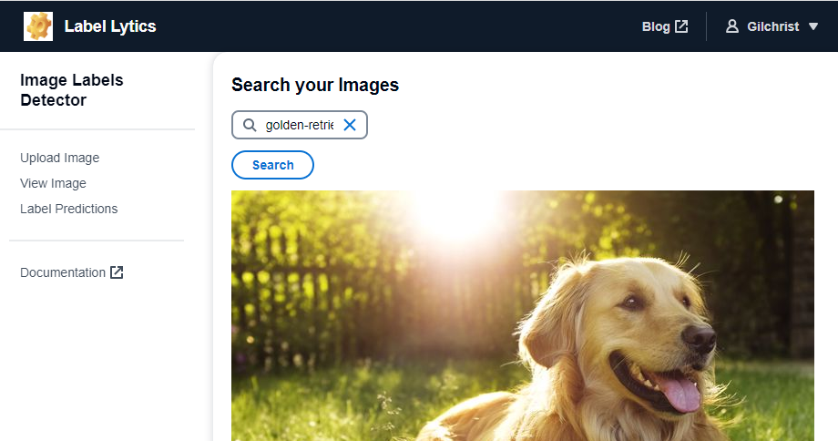
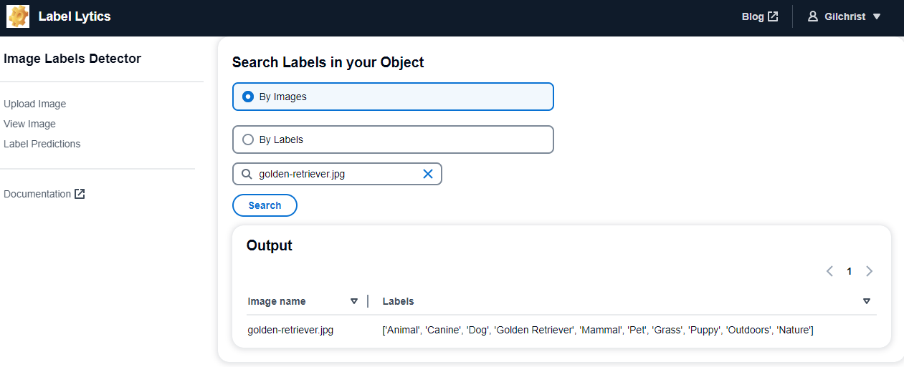
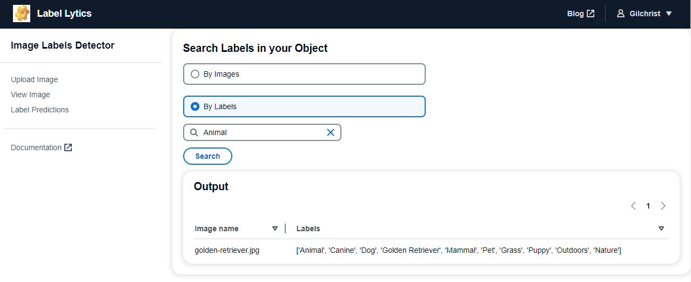

# Label Lytics
Image label detector app

## Blog
https://scripting4ever.wordpress.com/2023/10/02/html-strings-to-pdf-generation-using-aws-services/](https://scripting4ever.wordpress.com/2023/10/04/an-image-label-detector-app-using-aws-services/

## Resources Created
- S3 for Website hosting
- API GW
- Lambda - 2
- S3 for image storage
- Cognito user pool and Identity pool
- DynamoDB
- IAM Roles

## Architecture 
<kbd>
  
</kbd>

## Features

1. Used to upload the image and find the objects in the images
2. User authentication via Cognito
3. CloudWatch logs to store the lambda logs
4. All Infrastructure is deployed via Terraform using GitAction pipeline
5. Frontend is made of React

## Pre-Requisites

1. Create a  __S3 Bucket__ to store the Terraform backend file and update the __provider.tf__
```terraform
terraform {
  backend "s3" {
    bucket = "gitaction"
    key    = "gittfstate"
    region = "ap-southeast-1"
  }
}
```

2. Create an IAM user with required privileges and download the accesskey id and secret access key

3. Create GitHub __Secrets__

<p align="center">
  <b>Secrets</b>
</p>

- **_AWS_ACCESS_KEY_ID_** : AWS Access Key ID
- **_AWS_SECRET_ACCESS_KEY_** : AWS Secret Access Key

<kbd>
  
</kbd>

8. Fill the __terraform.tfvars__
```terraform
project          = "cognitodemo"
front_end_bucket = "cognitodemorekog"
s3_lambda_zip    = "s3_lambda.zip"
apigw_lambda_zip = "apigw_lambda.zip"
apigw_stage      = "dev"
```

## Terraform Build
1. Go to GitHub -> Actions
2. Select the Branch and Apply

<kbd>
  
</kbd>

<p align="center">
  <b>Pipeline</b>
</p>

<kbd>
  
</kbd>

## Terraform Destroy
1. Go to GitHub -> Actions
2. Select the Branch and Destroy
<kbd>
  
</kbd>

## App 

1. User Sign-in
<kbd>
  
</kbd>

2. Upload Image
<kbd>
  
</kbd>

3. View Image
<kbd>
  
</kbd>

4. Detect labels using image name
<kbd>
  
</kbd>

5. Detect labels using label key
<kbd>
  
</kbd>

## Developer

Designed and developed by K.Janarthanan
